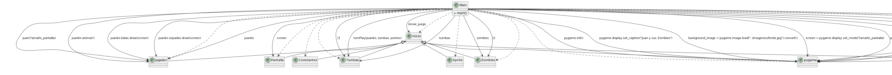

Juan y sus zombies
==================
---

### Sipnosis
Este juego consiste en lograr sobrevivir el tiempo máximo posible para el jugador, para lograr esto deberá destruir los zombies que aparecerán a los largo del turno, al mismo tiempo debe pasar las lápidas para poder lograr obtener puntos. Al comienzo del juego el jugador contará con un total de tres vidas, momento que uno de los zombies logre toque al avatar, este perderá una vida. 

* __Cantidad de vidas:__
El jugador el comienzo de cadad partida contará con un total de tres (3) vidas, dichas vidas van a disminuir cada vez que un zombie o mano, logre tocar al avatar.

* __Ganar puntos:__
Los puntos que ganará el usuario a lo largo de la partida, se irán sumando cada vez que el usuario logre pasar una lápida.

* __Mover al avatar:__
Para poder mover al avatar a lo largo de la pantalla, es necesario usar las flechas (izquierda y derecha) del teclado

* __Armas del avatar:__
El avatar cuenta con un total de dos armas, para poder disparar es necesario usar la tecla "Z", para poder usar la espada, se necesita hacer uso de la tecla "X"
 
 * __Iniciar el juego:__
 Para poder iniciar la partida, en el fondo se podrá observar un texto indicando la tecla necesaria para poder empezar, en caso de que no sea posible observar dicho texto, oprimir la tecla "Enter" del teclado y atomáticmente el juego dará inicio a la partida. 

 ### Diagrama en plantUML:  
 

 